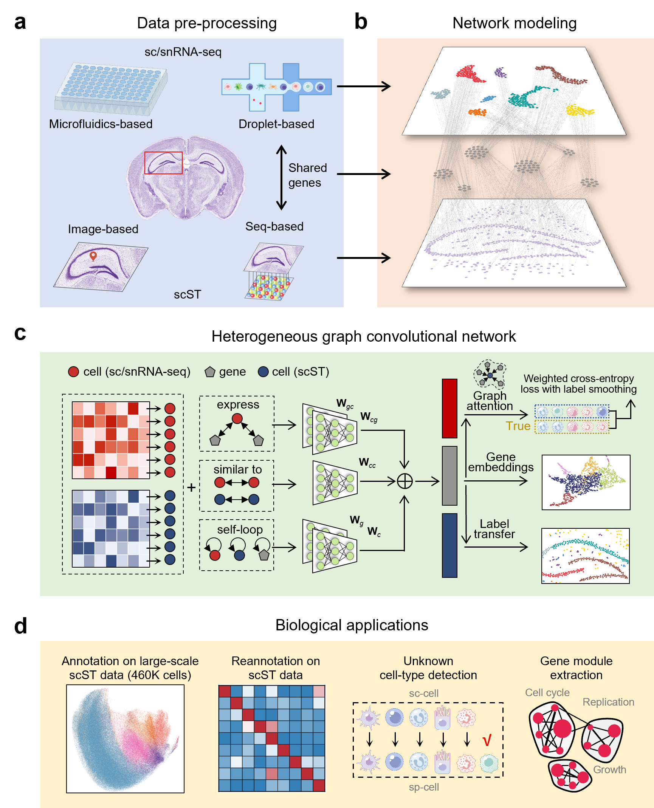

# STAMapper

## Overview
STAMapper is a method that annotates cells from single-cell spatial transcriptomics (scST) data. STAMapper is a deep learning-based tool that uses a heterogeneous graph neural network to transfer the cell-type labels from single-cell RNA-seq (scRNA-seq) data to scST data. 

We also collected 81 scST datasets consisting of 344 slices and 16 paired scRNA-seq datasets from eight technologies and five tissues, served as a benchmark for scST annotation (can be downloaded from [here](https://drive.google.com/drive/folders/1xP3Fh94AwKu4OsH3khGq-KEw0VCoiRnL)).



## Prerequisites
It is recommended to use a Python version  `3.9`.

## Software dependencies
The important Python packages used to run the model are as follows: 
```
scanpy[leiden]>=1.9.1,<=1.9.5
torch>=1.12.0,<=2.0.1
torchvision>=0.13.0,<=1.15.2
dgl==1.1.2
```
STAMapper is running on GPU, the versions of torch and torchvision 
need to be compatible with the version of CUDA.


## Installation
After downloading STAMapper from [Github](https://github.com/zhanglabtools/STAMapper), 
you can install STAMapper via

```
cd STAMapper-main
python setup.py build
python setup.py install
```
## Tutorials
The following are detailed tutorials. All tutotials were ran on a 12600kf cpu and a 3060 12G gpu.

1. [Simulation experiment](./tutorials/T1_simulation_experiment.ipynb)

2. Localization of human brain [MTG](./tutorials/T2_human_MTG_DLPFC.ipynb) and [M1](./tutorials/T2_human_M1_DLPFC.ipynb) cells on human DLPFC sections

3. [Localization of human SCC cells on tissue sections](./tutorials/T3_human_SCC.ipynb)

4. [Data enhancement of mouse hippocampus Slide-seq dataset](./tutorials/T4_mouse_hippo_slideseq.ipynb)

5. [Data extension of mouse visual cortex STARmap dataset](./tutorials/T5_mouse_visual_cortex_starmap.ipynb)

